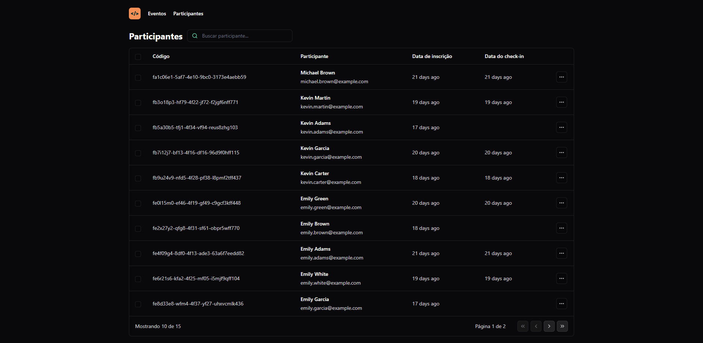

# pass.in
pass.in is an application for managing participants in in-person events.

Project originated at the rocketseat event, [nlw](https://www.rocketseat.com.br/eventos/nlw).

## Backend
- REST API developed with Spring and SQLite database

Spring dependencies used:
1. Spring Boot
2. Spring Web
3. Spring Data JPA
4. Flyway Migration
5. Lombok

### Features
- [x] Register a new event;
- [x] View event data;
- [x] View the list of participants; 
- [x] The participant must be able to register for an event;
- [x] The participant must be able to view their registration badge;
- [x] The participant must be able to check-in at the event;
- [x] The participant can only register for an event once;
- [x] Participants can only register for events with available places;
- [x] The participant can only check-in to an event once;

### Endpoints
[Docs](https://nlw-unite-nodejs.onrender.com/docs/static/index.html#/)

## Frontend
- Built with React and Tailwind CSS

### Interface
