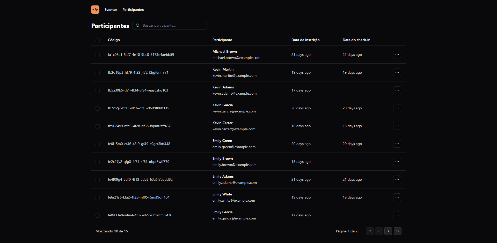

# pass.in

pass.in is a fullstack event check-in platform for managing in-person events, attendee registrations, badges, and check-ins.

The project was originally based on Rocketseat's NLW event and is being evolved with a custom fullstack roadmap focused on production-style backend contracts, a real React frontend flow, PostgreSQL persistence, Docker setup, OpenAPI documentation, and relevant tests.

## Stack

- Java 21
- Spring Boot 4.1
- Spring Web
- Spring Data JPA
- Flyway
- PostgreSQL
- React 19
- TypeScript
- Vite 8
- Tailwind CSS 4

## Current Features

- Register events
- View event details
- Register attendees for an event
- List event attendees
- Generate attendee badges
- Check attendees in
- Prevent duplicate attendee registration in the same event
- Prevent registration when an event is full
- Prevent duplicate check-ins

## Planned Improvements

- Expand Docker Compose to run the full stack
- Add backend DTO validation and standardized API errors
- Add OpenAPI/Swagger documentation
- Add event listing, attendee search, and backend pagination
- Replace hardcoded frontend event data with routes and API state
- Add registration, badge, and QR code check-in screens in the frontend
- Add backend tests for event registration and check-in rules
- Add CI and final Docker setup

## Backend

The backend is a Spring Boot REST API located in `backend`.

Start PostgreSQL:

```bash
docker compose up -d postgres
```

The default local database URL is:

```text
jdbc:postgresql://localhost:5432/pass_in
```

You can override the connection with:

```text
DATABASE_URL
DATABASE_USERNAME
DATABASE_PASSWORD
```

Run tests:

```bash
cd backend
./mvnw test
```

Run locally:

```bash
cd backend
./mvnw spring-boot:run
```

## Frontend

The frontend is a React application located in `frontend`.

Install dependencies:

```bash
cd frontend
npm install
```

Run locally:

```bash
npm run dev
```

Build:

```bash
npm run build
```

## Interface


